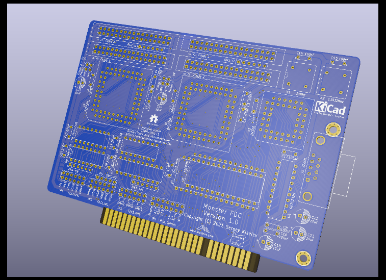

# monster-fdc
ISA floppy disk controller card that supports up to 8 floppy drives

## Introduction
Monster FDC is an ISA floppy disk controller board that features two FDCs. Each FDC supports up to four floppy drives. IRQ and DMA channel are configruable for the secondary FDC, and they are hardwired to IRQ6 and DMA2 for the primary FDC. The board also includes a serial port (UART) with configruable I/O ports and IRQ.

## Hardware Documentation

### Schematic and PCB Layout

[Schematic - Version 1.0](KiCad/isa_monster_fdc-Schematic-1.0.pdf)

[PCB Layout - Version 1.0](KiCad/isa_monster_fdc-Board-1.0.pdf)
