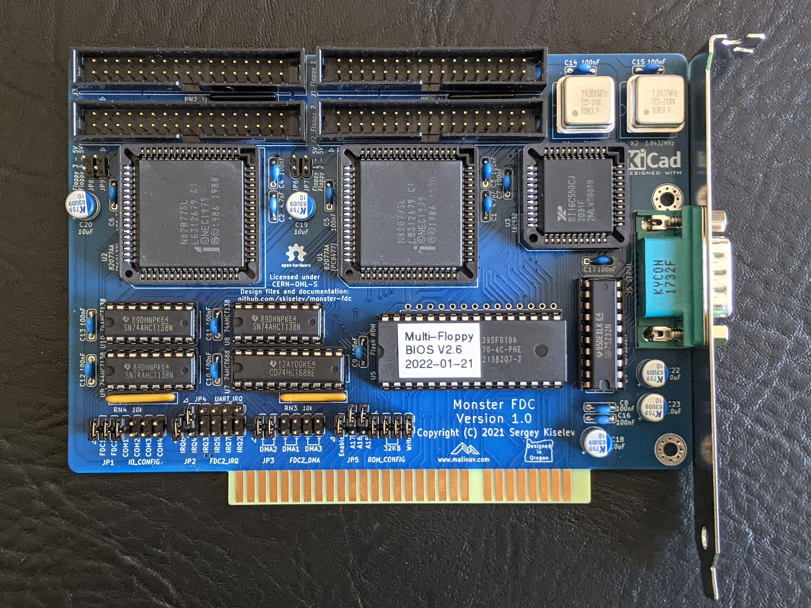

# monster-fdc
ISA floppy disk controller card that supports up to 8 floppy drives

## Introduction
Monster FDC is an ISA floppy disk controller board that features two FDCs. Each FDC supports up to four floppy drives. IRQ and DMA channel are configruable for the secondary FDC, and they are hardwired to IRQ6 and DMA2 for the primary FDC. The board also includes a serial port (UART) with configruable I/O address and IRQ.

 

## User Manuals

[User Manual](User_Manual.md)

## Hardware Documentation

### Schematic and PCB Layout

[Schematic - Version 1.0](KiCad/isa_monster_fdc-Schematic-1.0.pdf)

[PCB Layout - Version 1.0](KiCad/isa_monster_fdc-Board-1.0.pdf)

### Bill of Materials

#### Version 1.0

[Monster FDC project on Mouser.com](https://www.mouser.com/ProjectManager/ProjectDetail.aspx?AccessID=8ae2858f5a) - View and order all components except of the PCB and the FDC ICs.

Monster FDC project on Tindie: [Complete Board](https://www.tindie.com/products/weird/monster-fdc-complete-board/); [Monster FDC PCB](https://www.tindie.com/products/weird/monster-fdc-pcb/).

Component type     | Reference | Description                                 | Quantity | Possible sources and notes 
------------------ | --------- | ------------------------------------------- | -------- | --------------------------
PCB                |           | Monster PCB - Version 1.0                   | 1        | Buy from my Tindie store: [Monster FDC PCB](https://www.tindie.com/products/weird/monster-fdc-pcb/), or order from a PCB manufacturer of your choice using provided Gerber or KiCad files
Integrated Circuit | U1, U2    | Intel 82077AA FDC, 68 pin PLCC              | 2        | eBay; Possible replacements: National Semiconductor PC8477BV-1 or PC8477AV-1, Intel 82077SL, Intel 82077AA with various suffixes
Integrated Circuit | U3        | 16C550 UART, 44 pin PLCC                    | 1        | Mouser [701-ST16C550CJ44-F](https://www.mouser.com/ProductDetail/701-ST16C550CJ44-F)
Integrated Circuit | U4        | GD75232N RS-232 Transceivers, 20 pin DIP    | 1        | Mouser [595-GD75232N](https://www.mouser.com/ProductDetail/595-GD75232N)
Integrated Circuit | U5        | SST39SF010A - 128 KiB Flash ROM, 32 pin DIP | 1*       | Mouser [804-39SF010A7CPHE](https://www.mouser.com/ProductDetail/804-39SF010A7CPHE); Possible replacements: 128 KiB, 256 KiB, or 512 KiB 5V only Flash ROMs from other vendors. Note: Install either U5 or U6. It is recommended to install U5
Integrated Circuit | U6        | 28C256 32 KiB or 28C64 8 KiB EEPROM, 28 pin DIP | 1*   | Mouser [556-AT28C25615PU](https://www.mouser.com/ProductDetail/556-AT28C25615PU), [556-AT28C64B15PU](https://www.mouser.com/ProductDetail/556-AT28C64B15PU). Note: Install either U5 or U6. It is recommended to install U5
Integrated Circuit | U7        | CD74HCT688E Magnitude Comparator, 20 pin DIP | 1       | Mouser [595-CD74HCT688E](https://www.mouser.com/ProductDetail/595-CD74HCT688E)
Integrated Circuit | U8 - U10  | SN74AHCT138N 3-to-8 Decoder, 16 pin DIP     | 3        | Mouser [595-SN74AHCT138N](https://www.mouser.com/ProductDetail/595-SN74AHCT138N)
Crystal Oscillator | X1        | 24 MHz, 4 pin DIP, Half Can                 | 1        | Mouser [520-TCH2400](https://www.mouser.com/ProductDetail/520-TCH2400)
Crystal Oscillator | X2        | 1.8432 MHz, 4 pin DIP, Half Can             | 1        | Mouser [520-TCH184-X](https://www.mouser.com/ProductDetail/520-TCH184-X)
Connector          | J1 - J4   | 2x17 pin shrouded header, 2.54 mm pitch, vertical | 4  | Mouser [517-30334-6002](https://www.mouser.com/ProductDetail/517-30334-6002)
Connector          | J5        | DE-9 D-Sub connector, male, right angle     | 1        | Mouser [806-K22X-E9P-N-99](https://www.mouser.com/ProductDetail/806-K22X-E9P-N-99)
Pin Header         | JP1 - JP3 | 2x6 pin header, 2.54 mm pitch, vertical     | 3        | Mouser [649-67996-112HLF](https://www.mouser.com/ProductDetail/649-67996-112HLF)
Pin Header         | JP4       | 2x7 pin header, 2.54 mm pitch, vertical     | 1        | Mouser [649-67996-114HLF](https://www.mouser.com/ProductDetail/649-67996-114HLF)
Pin Header         | JP5       | 1x5 pin header, 2.54 mm pitch, vertical     | 1        | Mouser [649-68000-205HLF](https://www.mouser.com/ProductDetail/649-68000-205HLF)
Pin Header         | JP6 - JP9 | 2x2 pin header, 2.54 mm pitch, vertical     | 2*       | Mouser [649-67996-104HLF](https://www.mouser.com/ProductDetail/649-67996-104HLF). Note: Do not install unless using PS/2 floppy drives that are powered by pin 3
Capacitor          | C1, C2    | 4.7 nF, 50V, MLCC, 5 mm pitch               | 2*       | Mouser [810-FG28X7R1H472KNT0](https://www.mouser.com/ProductDetail/810-FG28X7R1H472KNT0). Note: Optional, only required when using Intel 82077AA FDC
Capacitor          | C3 - C17  | 100 nF, 50V, MLCC, 5 mm pitch               | 15       | Mouser [810-FG28X7R1H104KNT6](https://www.mouser.com/ProductDetail/810-FG28X7R1H104KNT6)
Capacitor          | C18 - C23 | 10 uF, 63V, Organic Polymer, 6.3 mm diameter, 2.5 mm pitch| 5 | Mouser [80-A759EA106M1JAAE60](https://www.mouser.com/ProductDetail/80-A759EA106M1JAAE60)
Resistor Array     | RN1, RN2  | 1 kohm, bussed, 6 pin SIP                   | 2        | Mouser [652-4606X-1LF-1K](https://www.mouser.com/ProductDetail/652-4606X-1LF-1K)
Resistor Array     | RN3, RN4  | 10 kohm, bussed, 6 pin SIP                  | 2        | Mouser [652-4606X-1LF-10K](https://www.mouser.com/ProductDetail/652-4606X-1LF-10K)
IC Socket          | U1, U2    | 68 pin PLCC, through hole                   | 2        | Mouser [517-8468-11B1-RK-TP](https://www.mouser.com/ProductDetail/517-8468-11B1-RK-TP)
IC Socket          | U3        | 44 pin PLCC, through hole                   | 1        | Mouser [517-8444-11B1-RK-TP](https://www.mouser.com/ProductDetail/517-8444-11B1-RK-TP)
IC Socket          | U4, U7    | 20 pin DIP                                  | 2        | Mouser [649-DILB20P-223TLF](https://www.mouser.com/ProductDetail/649-DILB20P-223TLF)
IC Socket          | U5        | 32 pin DIP                                  | 1*       | Mouser [649-DILB32P223TLF](https://www.mouser.com/ProductDetail/649-DILB32P223TLF). Note: Install either U5 or U6. It is recommended to install U5
IC Socket          | U6        | 28 pin DIP                                  | 1*       | Mouser [649-DILB28P223TLF](https://www.mouser.com/ProductDetail/649-DILB28P223TLF). Note: Install either U5 or U6. It is recommended to install U5
IC Socket          | U8 - U10  | 16 pin DIP                                  | 1        | Mouser [649-DILB16P-223TLF](https://www.mouser.com/ProductDetail/649-DILB16P-223TLF)
Oscillator Socket  | X1, X2    | 4 pin DIP, Half Can                         | 2        | Mouser [535-1108800](https://www.mouser.com/ProductDetail/535-1108800)
Jumper             | JP1 - JP5 | Shunt, 2 pin 2.54 mm pitch                  | 13       | Mouser [806-SX1100-B](https://www.mouser.com/ProductDetail/806-SX1100-B)
Computer Bracket   |           | Keystone Electronics 9200-1 Bracket with DE-9 cut-out | 1 | Mouser [534-9200-1](https://www.mouser.com/ProductDetail/534-9200-1). Note: Use when serial port components are populated
Screw              |           | 4-40 Hex screw for D-Sub Connector          | 2        | Mouser [806-JSX-1000](https://www.mouser.com/ProductDetail/806-JSX-1000). Note: Use when serial port components are populated
Computer Bracket   |           | Keystone Electronics 9202 ISA Bracket       | 1        | Mouser [534-9202](https://www.mouser.com/ProductDetail/534-9202). Note: Use when serial port components are **not** populated
Screw              |           | 4-40 / 1/4" screw (for attaching ISA Bracket to the board) | 2 | Mouser [534-9900](https://www.mouser.com/ProductDetail/534-9900). Note: Use when serial port components are **not** populated

#### Component Selection Notes

The board can be populated with some or all of the following devices:
* Primary FDC controller
* Secondary FDC controller
* Serial port / UART
* BIOS extension ROM (aka boot ROM)

The table below provides the list of components that are required for each one of the devices

Device/Functionality     | Components
-------------------------|------------------------------------------------------------------------------------------------
Primary FDC Controller   | U1, U8, U9, X1, J1, J2, JP1, JP6**, JP7**, C1*, C3, C5, C11, C12, C14, C19, RN1, RN4
Secondary FDC Controller | U2, U8, U10, X1, J3, J4, JP1, JP2, JP3, JP8**, JP9**, C2*, C4, C6, C11, C13, C14, C20, RN2, RN4
Serial port / UART       | U3, U4, U8, U9, X2, J5, JP1, JP2, JP4, C7, C8, C11, C12, C15, C16, C17, C22, C23, RN4
BIOS extension ROM       | U5***, U6***, U7, JP5, RN3, C9, C10
Shared components        | C18

Notes:
* \* - only required for Intel 82077AA FDCs
* \** - only required when using IBM PS/2 floppy drives that are powered by 5V on pin 3
* \*** - install either U5 (recommended) or U6
* Use Keystone Electronics 9200-1 Bracket when populating serial port components. This bracket attaches to the serial port DE-9 connector
* Use Keystone Electronics 9202 ISA Bracket when not populating serial port components. This bracket attaches to the board with a couple of 4-40 screws

#### Possible Component Replacements

* U1, U2 - Intel 82077AA FDC
  * National Semiconductor PC8477BV-1 - recommended
  * Intel N82077SL - recommended
  * Intel N82077AA - recommended, no tape support
  * Intel N82077AA-1 - tape support, FM broken
  * Intel N82077AA-5 - doesn't support 1 Mbps rate / ED disks
  * National Semiconductor PC8477AV-1 - older version of PC8277BV-1
* U3 - 16C550 UART
  * Most 16450/16550A type UARTs in PLCC-44 package supporting 5V operation
  * 16C550 and 16550A type UARTs from other vendors - Texas Instruments, National Semiconductor, MaxLinear, NXP Semiconductors
  * 16C650, 16C750, 16C850 type UARTs (longer FIFO)
  * 16C450, 16450, 16550 type UARTs without FIFO
* U4 - GD75232N RS-232 Transceivers 
  * Texas Instruments SN75185N, SN75C185
* U5 - 128 KiB Flash ROM 
  * Most 128 KiB, 256 KiB, and 512 KiB Flash ROM ICs in DIP-32 package supporting 5V-only operation. Note that only first 32 KiB will be used regardless of the ROM capacity
  * Microchip/SST SST39SF010A, SST39SF020, SST39SF040
  * AMD Am29F010, Am29F020
  * Winbond W29EE011
  * Atmel AT29C010A
  * Greenliant/SST SST29EE010/GLS29EE010
* U6 - 32 KiB or 8 KiB EEPROM
  * Atmel AT28C256, AT28C64B
* U7 - CD74HCT688E Magnitude Comparator
  * 74HCT688
  * 74LS668, 74F521
* U8 - U10 - SN74AHCT138N 3-to-8 Decoder
  * 74AHCT138
  * 74HCT138
  * 74ALS138, 74F138, 74LS138
* X1
  * Other 24 MHz half can 5V oscillators
* X2
  * Other 1.8432 MHz half can 5V oscillators

## Release Notes

### Changes

* Version 1.0
  * Initial version

### Known Issues

None, so far

## Red Tape

### Licensing

Monster FDC is an open source hardware project certified by [Open Source Hardware Association](https://www.oshwa.org/), certification UID is [US00xxxx](https://certification.oshwa.org/us00xxxx.html). The hardware design itself, including schematic and PCB layout design files are licensed under the strongly-reciprocal variant of [CERN Open Hardware Licence version 2](license-cern_ohl_s_v2.txt). The [Multi-Flopppy BIOS](https://github.com/skiselev/floppy_bios) code is licensed under [GNU General Public License v3](license-gpl-3.0.txt). Documentation, including this file, is licensed under the [Creative Commons Attribution-ShareAlike 4.0 International License](license-cc-by-sa-4.0.txt).

